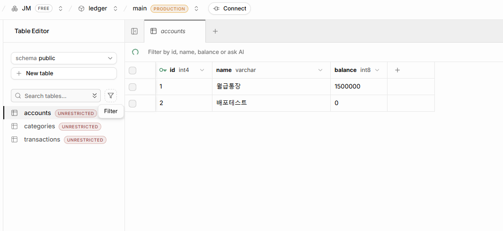
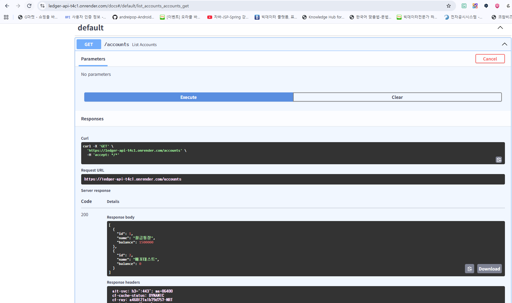

https://github.com/Funny-JMY/ledger-api.git
https://ledger-api-t4c1.onrender.com

· 계좌·거래를 두 테이블로 나눈 이유(1:N 관계)
- 계좌의 balance는 stock 개념, 거래는 flow 개념이라 분리가 필요 즉 1:N의 관계

· SQLAlchemy 모델 클래스와 실제 테이블의 대응
- 모델 클래스(Account, Category, Transactio)이 각각 실제 테이블 accounts, categories, transactions에 대응함.

· 접속 문자열을 .env로 분리하는 이유
- github에 환경변수를 올리지 않기 위해. 공유되지 않아야하는 키값이 들어가 있음.

- 교수님이 제공해주신 워크북을 따라 하나씩 따라가며 검증하였고 AI도움없이도 문제없이 진행되었습니다.